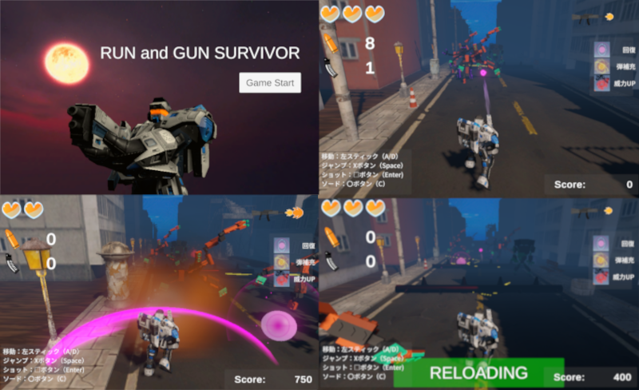

# RunAndGunSurvivor

## プログラムの場所
* Assets/Scriptsフォルダ：各スクリプト

## 作品の概要

### 作品について
Unityでの3Dゲーム開発の基礎を習得するため、書籍を参考に3Dモデルの配置、マテリアル・シェーダーの設定、カメラワーク等のビジュアル面を構築しました。  
その土台の上で、ゲーム性に関しては独自に設計。ランアクションにリソース管理とコンバット要素を組み合わせ、単なる学習用サンプルに留まらないアクションゲームとして完結させました。  
3Dのランアクションゲームに、銃撃と近接攻撃（ソード）の要素が加わっており、動的に変化するステージの中で、リソース管理（残弾数）と瞬時の判断が求められるゲーム性を目指しています。  

[サンプルゲームをプレイ](https://kanrakara.github.io/run_gun_web/)

### 作品の遊び方
奥へと自動で進むプレイヤーを操作し、エネミーを破壊しながらゴールを目指します。

* **移動（左右）**：ADキー / 矢印キー / 左スティック(ゲームパッド）
* **ジャンプ**：スペースキー / Southボタン(ゲームパッド）
* **ショット（遠距離）**：エンターキー / Westボタン(ゲームパッド）
    * 弾（Bullet）を消費します。弾切れ時はマガジンを消費して自動リロードします。
* **ソード（近接）**：Cキー / Eastボタン(ゲームパッド）
    * 前方の敵をなぎ倒します。攻撃中は移動や射撃が制限されるため、リスク管理が重要です。

## 使用技術・ツール
* Unity (6000.3.5f2)
* VisualStudio community2026 C#
* SourceTree
* 参考書籍：Unity2021 3D/2D ゲーム開発実践入門（ソシム）
* 利用アセット Robot Hero : PBR HP Polyart , Fantasy Skybox FREE, Russian buildings lowpoly pack , Free Quick Effects Vol. 1  

## 制作期間
* 2026年3月1日～2026年3月17日

## 制作のポイント
### 独立したコルーチンによる動的ステージ生成
エネミー、アイテム、トラップをそれぞれ個別のコルーチンで管理しています。これにより、特定のオブジェクトだけ出現頻度を変えるといった調整が容易になっています。

### ユーザー体験を高めるUI演出
プレイヤーの状況を直感的に伝える工夫を凝らしています。
* 動的なリロード演出:
リロード中、Sin 関数を用いて警告パネルを高速点滅させ、視覚的に今は撃てないことを強調しました。

* 柔軟な情報更新:
体力、スコア、銃の威力（スプライト切り替え）、弾薬残数をそれぞれ独立したメソッドで更新可能にし、ゲームロジックからの呼び出しやすさを確保しています。

### 状況に応じたSE・アニメーションの同期
* 移動速度に応じた足音（Footsteps）の再生タイミングをタイマーで制御したり、ダメージ時にパワーダウン演出とUI更新を同時に走らせるなど、プレイヤーへのフィードバックを重視しました。

## 課題
現在はオブジェクトを都度生成していますが、大量のオブジェクトを扱う場合に備え、オブジェクトプーリングの実装や他の方法についても学んでいきたいです。  
  
## 所感
Input Systemの挙動理解や、複数の並走するコルーチン（生成・リロード・攻撃）の制御に苦労しましたが、その分ゲームとしての手触りを細かく作り込むことができました。特に、プレイヤーのピンチを検知してアイテムを出すといったユーザーの体験に寄り添ったロジックを実装できたことが大きな収穫です。  
  
